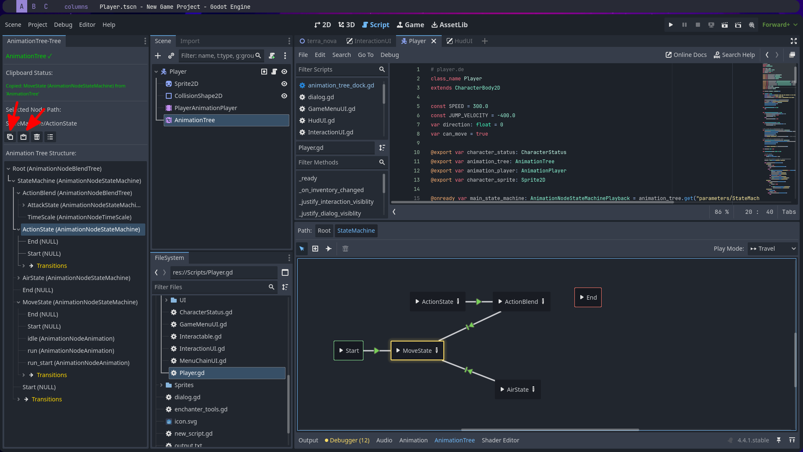

# Backup  
Back up your `.tscn` file.

# AnimationTree‑Tree (Alpha)  
Enhances the AnimationTree experience by adding features:

- Mainly: copy, paste, and delete AnimationTree nodes  
- Show all “transition expressions”  
- Output the TreeView structure as Markdown  

# Limitations and Bugs  

- After pasting/deleting something in a BlendTree, you must re‑select the AnimationTree to see the effect. This issue affects only BlendTrees.  
- Cross‑copy & paste: copying something from **AnimationTree A** to another **AnimationTree B** also copies the `AnimationPlayer` references from **A** to **B**. Although the copied animations work on **B**, this behavior is not intended because **B** does not have the `AnimationPlayer` assigned from **A**.  
- The TreeView collapse logic is currently just a prototype.  
- Although I tried to catch relevant events to refresh the virtual TreeView, the refresh logic can still be incomplete.