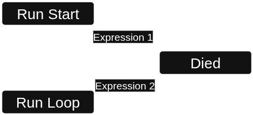

  

# AnimationTreeTree

AI-powered animation tree generator for Godot Engine. With other cool functions like copy/paste/merge AnimationTree nodes.

## What is AnimationTreeTree?

AnimationTreeTree is a Godot addon that uses AI to generate complete animation state machines with sub-states, transitions, and controller scripts. The name comes from creating a "virtual tree" of your actual animation tree.

## Important Notes ⚠️

> [!WARNING]
> **No undo support yet** - Make sure to backup your project before using AnimationTreeTree

## Features

> [!NOTE]
> This is an early-phase hobby project. More experts and features/improvements are planned for the future.

### State Machine Generator
- Creates complete animation state machines with nested sub-states
- Automatically sets up transitions between states
- Supports animation nodes and blend trees (blend tree connections coming soon)

### Script Generator
- Generates controller scripts based on your selected nodes
- Creates boilerplate code using algorithms
- Uses AI to fill in the logic based on your animation tree structure
- Supports tool calling for better results

## How It Works

1. Open the prompt dialog in your animation tree
2. Select the appropriate expert (state machine or script generator)
3. Describe what you need
4. AnimationTreeTree generates the structure for you

The script generator works by:
- Creating a boilerplate code template based on your selected nodes
- Generating a YAML blueprint with animation names and expressions
- Using specialized AI prompts with these templates to produce deterministic results

### Function/Tool Calling through AI

AnimationTreeTree includes custom tool calling logic that helps the AI:
- Access your Godot input map (no more invented input strings)
- Read the Godot scripting guidelines to prevent mixing Godot 3 and 4 conventions
- Use the right functions and information for your project

# Additional Features

### Merge ⚠️
Merge multiple nodes into a single state machine
  

> [!WARNING]
> **Merge nodes carefully** - The merge feature (This is not an AI feature) is powerful but can cause not expected behaviors if certain edge cases exists. The algorithm tries to preserve structure GOOD as possible.

Here an dangerous EDGE CASE. 

Before:

  

After:

You can see that we preserved both outgoing transitions inside the new `Merged State Machine`. But we have an additional transition and `End` node that can lead to an unexpected behavior.

### Copy & Paste
Copy and paste nodes, state machines, or animations while keeping transitions
  

## Setup

AnimationTreeTree works with:
- LM Studio (local models - make sure to download models with the blue tool icon for tool calling support)
- Google Gemini
- Any API that supports OpenAI standard format

## Status

AnimationTreeTree is currently in early development. Contributions and feedback are welcome!
